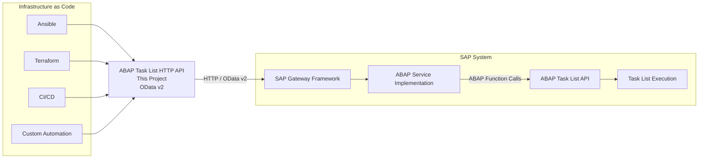

# Prototype! NOT FOR PRODUCTION!

# OData v2 Service API for STC ABAP Tasklist

This project provides a **minimal Proof-of-Concept (PoC) HTTP Service API for the SAP ABAP Task List API**. It is based on the concepts and functionality of ABAP Task Lists for automated configurations.

## Motivation

## Motivation

**Infrastructure as Code (IaC)** is gaining increasing [attention](https://learning.sap.com/courses/getting-started-with-terraform-on-sap-btp) within the SAP ecosystem. While the SAP BTP ecosystem already provides solid IaC capabilities through Terraform providers such as **[SAP BTP](https://registry.terraform.io/providers/SAP/btp/latest/docs)** and **[SAP Cloud Connector](https://registry.terraform.io/providers/SAP/scc/latest)**, the options for automating **on-premise SAP systems** remain more limited. Today, **[Ansible](https://docs.ansible.com/projects/ansible/latest/collections/community/sap_libs/index.html#)** is one of the most established approaches for implementing IaC principles in the on-premise SAP landscape.

At the same time, SAP has deprecated several open-source projects providing direct access to SAP RFC APIs from technologies such as **[Python](https://github.com/SAP-archive/PyRFC?tab=readme-ov-file#deprecation-notice) and [Node.js](https://github.com/SAP-archive/node-rfc) and [GO](https://github.com/SAP-archive/gorfc)**. This creates significant challenges for SAP automation and IaC, as important SAP capabilities can no longer be accessed easily from modern automation frameworks.

This project addresses this gap by providing a **lightweight HTTP interface based on OData v2 and the SAP Gateway Framework**. Although the Gateway Framework is a mature and comparatively traditional SAP technology, it offers an important advantage: **broad backwards compatibility with existing SAP systems**.

The service acts as a bridge between modern automation tools and the ABAP Task List API. It exposes the most important function modules required to **parameterize and execute ABAP Task Lists**, allowing external tools such as Ansible/Terraform to interact with these capabilities through a standard HTTP/OData interface.

The goal is not to replace existing SAP automation technologies, but to provide a **simple, backwards-compatible integration layer** that makes powerful ABAP functionality accessible again within modern **Infrastructure-as-Code and automation workflows**.

## Architecture 

## Architectural Considerations

The following table summarizes the main architectural trade-offs and advantages of the current approach:

| Category | Consideration | Description |
|---|---|---|
| ⚠️ **Trade-off** | **SAP Gateway prerequisite** | SAP Gateway must be installed, activated, and configured on the target SAP system before the service can be used. |
| ⚠️ **Trade-off** | **Wrapper project installation** | The ABAP wrapper project must be deployed to the target SAP system before the API is available. |
| ⚠️ **Trade-off** | **Limited zero-touch provisioning** | A complete provisioning of an SAP system from **point zero** may not be possible, since SAP Gateway and the wrapper service need to be available beforehand. |
| ⚠️ **Trade-off** | **Limited API surface** | The current prototype exposes only a subset of the available ABAP Task List functionality. The HTTP API does not yet provide a complete mapping of all Task List API function modules. |
| ⚠️ **Trade-off** | **Web security requirements** | Exposing SAP functionality through HTTP introduces additional security requirements. Authentication, authorization, HTTPS, input validation, network restrictions, and protection of sensitive data must be properly implemented. |
| ✅ **Advantage** | **High interoperability** | HTTP/OData is a widely supported, technology-independent interface that can be consumed by virtually any programming language or automation framework. |
| ✅ **Advantage** | **No cross-compilation required** | Automation clients do not require SAP-specific native libraries or platform-dependent binaries. This simplifies deployment across different operating systems and execution environments. |
| ✅ **Advantage** | **Established SAP framework** | SAP Gateway is a mature and widely used SAP technology. SAP developers are generally familiar with its development model, concepts, and tooling. |
| ✅ **Advantage** | **Easy extensibility** | The established Gateway Framework makes it straightforward for SAP developers to extend the project with additional function modules, entities, operations, and Task List capabilities. |
| ✅ **Advantage** | **Backwards compatibility** | OData v2 and the SAP Gateway Framework are available across a broad range of existing SAP systems, reducing the dependency on newer SAP APIs or platform components. |

### Architectural Trade-off

Overall, the architecture deliberately trades **initial SAP-side setup requirements** for **high interoperability and broad system compatibility**. Once SAP Gateway and the wrapper project are available, external automation tools can interact with ABAP Task Lists through a standard HTTP interface without requiring SAP-specific client libraries.

## Scope of the Prototype

The initial version focuses on:

- Executing ABAP Task Lists
- Setting and handling Task List parameters
- Implementing the key function modules used by the SAP Ansible module
- Providing a simple HTTP API for external automation tools
- Establishing a foundation for future, more comprehensive coverage of the ABAP Task List API

The implementation is intentionally limited to the **core functionality required for the initial Proof of Concept**. Future versions can extend the API to cover additional Task List API capabilities and more advanced automation scenarios.

## References

- SAP Learning: [Executing ABAP Task Lists for Automated Configuration](<https://learning.sap.com/courses/technical-implementation-and-operation-i-of-sap-s-4hana-and-sap-business-suite/executing-abap-task-lists-for-automated-configuration>)
- SAP Ansible Collection: [`community.sap_libs.sap_task_list_execute`](https://github.com/sap-linuxlab/community.sap_libs/blob/main/plugins/modules/sap_task_list_execute.py)
- SAP LinuxLab – [`community.sap_libs`](https://docs.ansible.com/projects/ansible/latest/collections/community/sap_libs/index.html#) GitHub repository
- Github Issue: [How to replace pyrfc requirement ??](https://github.com/sap-linuxlab/community.sap_libs/issues/46)
- Github Issue: [Terraform Provider for S/4 HANA - Minor Capabilities](https://github.com/SAP/terraform-provider-btp-services/issues/35)

